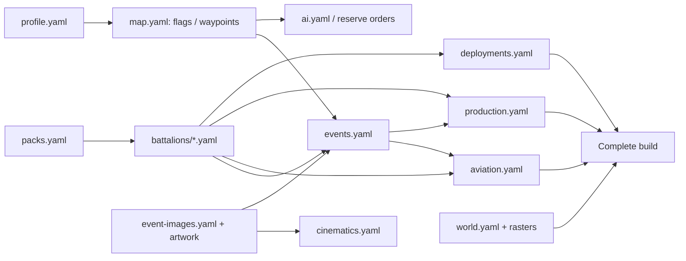

# Справочник YAML: полный формат кампании

Версия формата: **фреймворк 1.1.0**. Пример: [Кача V17.2](../campaigns/kacha/README.md). [Сборка и установка](GETTING_STARTED_RU.md) · [Практические изменения](RECIPES_RU.md) · [English](YAML_REFERENCE.md).

Таблицы описывают публичный формат, а не внутренние структуры WARNO. Пишутся только перечисленные поля. «Обязательно» означает, что поле нельзя пропустить, даже если его значение — пустой список `[]` или `null`. Все пути изображений относительны папке кампании, с `/`, без выхода через `..`.

## 0. Общие правила и связи

Сохраняйте UTF-8. Отступы — пробелы, обычно два на уровень; табуляция не подходит. `#` начинает комментарий вне кавычек, `-` — элемент списка. `true`/`false` — логические значения, `null` — отсутствие значения, `[]` — пустой список, `{}` — пустой объект. Текст с двоеточием заключайте в кавычки или используйте многострочную запись:

```yaml
text:
  ru: >-
    Разведка докладывает: противник готовит высадку.
    Подготовьте резервы.
  en: >-
    Intelligence reports an imminent landing.
    Prepare your reserves.
```

`>-` соединяет строки пробелами; `|-` сохраняет переносы. Повтор одного ключа внутри объекта — ошибка, а не способ дописать значения. При копировании элемента сохраняйте всю его вложенность.

| Понятие | Правило |
| --- | --- |
| Идентификатор `id` | Обычно `[a-z][a-z0-9_]*`: строчная латиница, цифры, `_`; начинается с буквы. Внутри своей категории уникален. Не переводится |
| `side` | `nato` или `pact`: внутренние коалиции, а не обязательно США/СССР |
| `country` | Поддерживаемый код страны: `US`, `SOV`, `RFA`, `RDA`, `DDR`, `UK`, `BEL`, `NL`, `POL`, `CAN`, `ESP`, `FR`, `TCH`, `CUB`; поддержка зависит от назначения визуального ресурса |
| Локализованный текст | Объект ровно с `ru` и `en`, обе непустые строки. Остальные языки — через `localization.yaml` |
| Координата | `[x, y]` в игровых единицах, внутри `profile.bounds`. Это не километры и не широта/долгота |
| Границы | `[min_x, min_y, max_x, max_y]` |
| Ход | Целое число, первый ход — `1`; сроки появления/событий находятся внутри `campaign.turns` |
| Короткое имя OOB | Батальон, подчинение, рота, взвод: 1–30 UTF-16 единиц во всех переводах. Латиница/кириллица обычно занимают одну единицу на знак |
| Усталость | `0` — свежий, `8` — предельно уставший. Число `7/8` не означает высокую боеспособность |
| ОД | Текущие очки, ёмкость и восстановление — разные настройки; подробнее в разделах батальона и размещения |



Обязательные файлы: `campaign.yaml`, `map.yaml`, `deployments.yaml`, `reinforcements.yaml`, `events.yaml`, `ai.yaml`, минимум один `battalions/*.yaml` и профиль, переданный сборщику. Авторский помощник ожидает профиль как `profile.yaml` в той же папке. Остальные документы опциональны в формате, но обязательны, если на их содержимое есть ссылки.

## 1. campaign.yaml — правила сценария

| Поле | Обязательно | Значение |
| --- | --- | --- |
| `schema` | Да | `1` |
| `id` | Да | Уникальная идентичность кампании. Для своей копии используйте `clone` |
| `template` | Да | Ровно `profile.yaml.id`; это идентификатор адаптера, не название в меню |
| `title` | Да | Название `{ru, en}` |
| `summary` | Да | Короткая строка задач `{ru, en}` для UI |
| `turns` | Да | Целое ≥ 2; длительность кампании |
| `date` | Да | Четыре целых `[год, месяц, день, период]`. Последнее число — период суток, не час. В Каче `[1989, 9, 7, 2]` даёт старт в 12:00 |
| `score_to_win` | Да | Положительное целое; порог обычной победы по очкам |
| `sides` | Да | Объекты `nato` и `pact`, каждый с непустым списком `countries` и `playable: true/false` |
| `victory` | Нет | Мгновенные цели и результат по истечении времени, ниже |
| `capture_deadline` | Нет | Ранний захват флага блокирует выбранную дивизию, ниже |
| `menu` | Нет | Самостоятельная карточка в меню, ниже |
| `ai_policy` | Нет | Общая политика ИИ, раздел 7 |

Дата должна быть календарно осмысленной; проверка формы четырёх чисел не заменяет проверку корректности даты. Продолжительность периода суток не задаётся отдельным публичным полем.

### victory

```yaml
victory:
  nato_capture: sevastopol
  pact_capture: kacha_beach
  time_limit: pact
```

Все три поля обязательны внутри блока. Первые два — **разные** ID флагов из `map.yaml.flags`; захват соответствующей стороной завершает кампанию. `time_limit`: `draw`, `nato`, `pact`. Если блока нет, применяется базовая система результата/очков адаптера. `capture_score`/`hold_score` флага и мгновенная победа — отдельные механизмы.

### capture_deadline

```yaml
capture_deadline:
  flag: simferopol
  owner: nato
  before_turn: 9
  division: sov_157
```

Все поля обязательны: известный флаг, сторона, срок от `2` до `turns`, ID дивизии из `production.yaml`. Контроль флага указанной стороной до срока фиксирует результат блокировки. Полковые группы этой дивизии не могут быть назначены раньше срока. Требуется направляемая ИИ production-система: у всех групп есть `ai`. После успешного раннего захвата позднее возвращение флага не отменяет уже зафиксированное предотвращение развёртывания.

События с `trigger.capture_deadline: blocked/not_blocked` сообщают результат, но сами по себе не создают это правило.

### menu

При наличии блока обязательны `header`, `subtitle`, `description`, `side_forces`, `image`, `attacker`.

| Поле | Смысл |
| --- | --- |
| `header` | Заголовок `{ru, en}` с поддерживаемой игровой разметкой |
| `subtitle` | Краткий подзаголовок `{ru, en}` |
| `description` | Развёрнутая ситуация/задачи `{ru, en}`; используйте `|-` для абзацев |
| `side_forces` | `nato: {ru,en}` и `pact: {ru,en}` — списки основных сил |
| `image` | Относительный PNG: ширина 400–4096, отношение ширины к высоте 1.5–2.5. Сборщик уменьшает до ширины 400 с сохранением пропорций |
| `attacker` | `nato` или `pact`; влияет на подписи «Атака/Защита» в меню |
| `side_titles` | Опциональные `nato: {ru,en}`, `pact: {ru,en}` для своих названий сторон. Без них используются подписи США/СССР примера |

`attacker` не назначает роль стратегического ИИ: это отдельно `ai_policy.native_strategies`. `menu.image` не является обложкой Workshop.

## 2. battalions/*.yaml — состав и стратегический тип

Каждый файл имеет `schema: 1` и список `battalions`. Можно разделить большой `forces.yaml` на несколько файлов в этой папке; ID батальонов остаются уникальными во всей кампании.

```yaml
schema: 1
battalions:
- id: my_infantry
  side: pact
  definition:
    country: SOV
    name: Мой пехотный батальон
    name_text: {ru: Мой пехотный батальон, en: My Infantry Battalion}
    organization: Моя бригада
    organization_text: {ru: Моя бригада, en: My Brigade}
    strategic:
      type: mechanized
      battle_role: fighter
      visual: {unit: BTR_80_Naval_SOV}
      icon: apc
    companies:
    - id: rifle
      name: Стрелковая рота
      name_text: {ru: Стрелковая рота, en: Rifle Company}
      hq: false
      platoons:
      - id: first
        name: Первый взвод
        name_text: {ru: Первый взвод, en: First Platoon}
        hq: false
        units:
        - type: cr_Naval_Rifle_SOV_465cec9510
          count: 3
```

Это минимальный **состав**, не готовый сценарий: батальон ещё нужно разместить одним из способов появления. Для полноценного боевого батальона добавьте реальные командные подразделения и поддержку.

| Поле | Обязательно | Смысл |
| --- | --- | --- |
| `id`, `side` | Да | ID батальона и коалиция |
| `definition.country` | Да для нового полного состава | Код страны; не угадывайте доступность юнита по одному этому коду |
| `definition.name`, `organization` | Да | Базовые короткие имена батальона/подчинения |
| `definition.name_text`, `organization_text` | Нет, рекомендуется | Явные `{ru,en}`; без них базовое имя может остаться общим |
| `definition.strategic` | Да | Стратегический тип, роль, модель |
| `definition.companies` | Да | Непустой список рот |
| `definition.formation` | Нет | Общая дивизия/бригада, полк и эмблема |
| `definition.initial_state` | Нет | Начальная усталость и нормальная ёмкость/восстановление ОД |

Старый вариант `definition: {catalog: ...}` существует для каталоговых адаптеров; он требует записи в `profile.battalion_catalog` с `authored: true`. Для своей кампании используйте полный состав с `country`, как Кача. Не смешивайте `country` и `catalog`.

### strategic

| Поле | Значения |
| --- | --- |
| `type` | `mechanized` для наземной части, `helicopter`, `airplane` |
| `battle_role` | `fighter`, `ground_support`, `auxiliary_support`, `air_support` |
| `visual` | `{unit: ID_из_units.csv}` — реальная модель/изображение, не источник состава или характеристик |
| `icon` | Опционально для наземных/вертолётных: `Infantry`, `apc`, `ifv`, `Armor`, `Armor_heavy`, `HQ`, `reco`, `AA`, `AT`, `hel`, `howitzer`, `mlrs`, `assault` |
| `aircraft_role` | Обязательно только для самолётов: `fighter`, `bomber`, `sead` |
| `support` | Опционально: `{kind: air_defence/artillery, radius_ap: число}` |

Для самолёта `type: airplane` обязательно сочетается с `battle_role: air_support`; `icon` вручную не задаётся. Истребитель должен содержать зарегистрированные истребители, `bomber` — бомбардировщики или самолёты ПТО, `sead` — ППВО; авиакрыло не содержит транспортных паков.

Для артиллерии задайте `mechanized`, `ground_support`, `support.kind: artillery`. Для ПВО — `mechanized`, `auxiliary_support`, `support.kind: air_defence`. `radius_ap` — конечное положительное число ≤ 1000 в стратегической AP-шкале, не километры. Развёртывание/использование поддержки выполняет штатная игра; эта запись не заставляет ИИ разворачивать её в каждом случае.

Строковые модельные пресеты также поддерживаются: `west_german_infantry`, `east_german_infantry`, `west_german_armor`, `east_german_armor`, `soviet_armor` — наземные; `us_helicopter` — вертолётный. Для новых работ предпочтительна явная модель `{unit: ...}`.

### formation и initial_state

```yaml
formation:
  division_id: my_brigade
  division_text: {ru: Моя бригада, en: My Brigade}
  regiment_id: my_regiment
  emblem: Texture_Division_Emblem_AGF_SOV_810
initial_state:
  fatigue: 0
  action_points: 12
```

В `formation` обязательны первые три поля; `emblem` опциональна. Части одной стороны с одинаковым `division_id` делят формирование и должны иметь согласованное название/эмблему; `regiment_id` задаёт подчинение полку. Собственный token объявляется в `emblems.yaml`; штатный берётся из каталога ресурсов игры.

`initial_state` содержит хотя бы одно из двух полей: `fatigue` 0–8, `action_points` 0–12. По умолчанию наземная часть имеет усталость 0 и 12 ОД с восстановлением 12. Для самолётов адаптер назначает 4/4 ОД. Наземное `initial_state.action_points` задаёт **также восстановление**; не ставьте 0 для временной блокировки. Для артиллерии можно поставить 5, для статичного ПВО — 4.

### companies, platoons, units

В каждой роте обязательны `id`, `name`, `hq: true/false`, непустые `platoons`; `name_text` опциональна. ID рот уникальны внутри батальона. Во взводе аналогично обязательны `id`, `name`, `hq`, непустые `units`; ID взводов уникальны внутри роты.

`hq` обозначает штабное место в структуре, но не превращает обычную пехоту в командный юнит. Используйте настоящие командные карточки/КШМ. Одна штабная рота может содержать командование, снабжение, ПВО, ПТО и сапёров отдельными взводами. FOB добавляется обычным pack-элементом, а не отдельным полем `fob`.

Каждый элемент `units` — **ровно** `{type: ID_пакета, count: целое_1–100}`. `type` берётся из `packs.csv` или собственного `packs.yaml`; это не tactical unit ID. Получаемое число бойцов/машин зависит ещё от `packs.number`. При `number: 1`, `count: 3` получите три одинаковых roster-элемента; при `number: 2` каждый такой элемент содержит две единицы.

## 3. packs.yaml — юнит, транспорт и опыт

Опциональный файл: `schema: 1`, `packs: [...]`. Он нужен, чтобы использовать сочетание, которого нет в готовых стратегических паках.

```yaml
schema: 1
packs:
- id: my_marines_btr60
  unit: Naval_Rifle_SOV
  transport: BTR_60_Naval_SOV
  experience: 1
  number: 1
```

| Поле | Правило |
| --- | --- |
| `id` | Уникальное имя `[A-Za-z0-9_]+`, не совпадающее со штатным pack ID |
| `unit` | Реальный tactical ID из `units.csv`, без `Descriptor_Unit_` |
| `transport` | Реальный зарегистрированный транспорт или `null`; поле обязательно |
| `experience` | Целое 0–3; опыт карточки |
| `number` | Целое 1–10; единиц в roster-элементе |

Вид бойцов определяется **unit**, а не названием ID. Для резервного подразделения выбирайте соответствующий реальный юнит в каталоге. Компилятор проверяет существование и транспортный тип, но не баланс/историческую достоверность сочетания.

Ссылка из взвода: `type: my_marines_btr60`. Для смены транспорта создайте отдельный pack с новым ID и поменяйте ссылки только в нужных взводах. Правка общего pack меняет все роты, где он используется. Фреймворк не изменяет броню, скорость, оружие или стоимость исходного tactical-юнита через этот файл.

## 4. map.yaml — правила и позиции стратегической карты

Корень: `schema: 1`, обязательные `influence_sources`, `flags`, `labels`. Дополнительно `waypoints`, `markers`, `strategic_grid`. Для объектов на карте ID и положения задаются здесь; видимые здания/деревья — отдельно в `world.yaml`.

### flags

```yaml
flags:
- id: belbek
  position: [903500, 435500]
  initial_owner: pact
  capture_score: 25
  hold_score: 0
  name: {ru: Бельбек, en: Belbek}
```

Все поля обязательны. `initial_owner` — `nato`, `pact` или `null`; `capture_score` и `hold_score` — целые ≥ 0. Список флагов непустой. ID флага используется в победе, маршрутах, событиях, ограничениях подкрепления и камере.

Флаг не заменяет географическую подпись. Если нужен город на карте независимо от отображения флага, добавьте отдельный label. Захват определяется стратегическим влиянием игры: наличие отрезанного юнита рядом с флагом не является отдельной победой по YAML.

### influence_sources

Каждая запись: `{side: nato/pact, position: [x,y], value: число_≥0}`. Список непустой. Это источники начального стратегического контроля/фронта; `value` — величина влияния, не радиус, не ОД и не очки победы.

Для флага с объявленным владельцем ближайший исходный источник должен принадлежать этой стороне; равноудалённые конфликтующие источники отвергаются. Если переносите флаг за фронт другой стороны, переместите соответствующее влияние или измените владельца осмысленно. Не рассчитывайте, что поле `initial_owner` само исправит противоречащий ему фронт.

### labels, markers и waypoints

| Секция | Поля | Назначение |
| --- | --- | --- |
| `labels[]` | `id`, `position`, `text: {ru,en}`, `size: large/medium/small` | Географическая подпись |
| `markers[]` | `id`, `position`, `name: строка` | Краткая общая подпись; превращается в small-label с одинаковым текстом RU/EN |
| `waypoints[]` | `id`, `position` | Невидимая маршрутная точка для ИИ |

ID waypoint не совпадает с ID другого waypoint или флага. Label/marker **не** становится целью ИИ: цель объявите как флаг или waypoint. Точка прибытия production тоже не становится автоматически целью маршрута; при необходимости добавьте отдельный waypoint.

### strategic_grid

```yaml
strategic_grid:
  dimensions: {width: 48, height: 55}
  bounds: [676000, 208000, 1300000, 923000]
  default_terrain: StrategicPlain
  cells:
  - {row: 0, column: 0, terrain: StrategicPlain, road: true}
  # Здесь должны быть ВСЕ остальные клетки, не только изменённые.
```

Обязательны `dimensions`, `bounds`, `default_terrain`; `cells` опциональна. При отсутствии `cells` создаётся полностью однородная сетка. Если список есть, он содержит **каждую** клетку ровно один раз: строки 0…height−1 и столбцы 0…width−1. Одна запись: обязательные `row`, `column`, опциональные `terrain` (по умолчанию default), `road: true/false` (по умолчанию false), `id: r0c0` (если задан, должен соответствовать индексам).

Типы клеток: `StrategicPlain`, `StrategicForest`, `StrategicSemiUrban`, `StrategicUrban`, `StrategicWater`; профиль должен согласовываться с выбранным default. Дорога через `StrategicWater` запрещена. Горы не имеют самостоятельного публичного типа `StrategicMountain` в этом формате: видимый горный рельеф задаётся миром, а стратегическое поведение — поддерживаемыми типами клеток.

`road` и terrain влияют на стратегическую модель движения. Дорога, просто нарисованная на `surface.png`, сама по себе его не ускоряет. Лесные/городские клетки не создают деревья/здания автоматически. Автор одновременно настраивает правила в `map.yaml` и изображение/объекты в `world.yaml`.

Для Качи шаг нативной AP-клетки — 13 000 игровых единиц. Центр авторской клетки вычисляется как `min_x + (column + 0.5) × ширина_клетки`, аналогично для y. При изменении размеров согласуйте `profile.strategic_map`, границы игрового участка и raster/grid-размеры. Не используйте широту/долготу вместо игровых координат.

## 5. deployments.yaml — части на старте

Корень: `schema: 1`, `deployments: [...]`. Элемент обязательно содержит `id`, `battalion`, `side`, `position`, `fatigue`, `action_points`, `frozen_turns`; `initial_losses` опционально.

```yaml
deployments:
- id: dep_sov_880
  battalion: sov_880
  side: pact
  position: [890500, 500500]
  fatigue: 2
  action_points: 11
  frozen_turns: 0
  initial_losses: {max_percent: 25}
```

`id` — ID **размещения**, по нему пишет приказ `ai.yaml`. `battalion` — ID **состава** из `battalions/*.yaml`; это разные сущности. Сторона должна совпадать с батальоном. На старте здесь размещаются наземные/вертолётные части, не авиационные крылья.

`fatigue`: целое 0–8. `action_points`: неотрицательное целое текущих стартовых ОД; выбирайте его не выше нормальной ёмкости части. `frozen_turns`: неотрицательное целое числа заблокированных ходов владельца. `2` блокирует часть на два хода; после освобождения она восстанавливает текущие ОД и возвращается к штатному восстановлению. Не меняйте для этого постоянную ёмкость в определении батальона на ноль.

Потери бывают двух форм:

- `{max_percent: 25}`: задаёт верхнюю долю уничтожаемых roster-слотов, целое от 0 до 99. Это не гарантированные 25% людей, стоимости или отображаемой общей боеспособности; разнородные паки имеют разный вес.
- `{budget: 40, random_range: 0}`: низкоуровневый бюджет потерь и разброс, целые ≥ 0; разброс ≤ budget, сумма укладывается в int32. Бюджет не является процентом. Нулевой разброс фиксирует бюджет, но не выбранные случайно карточки.

В Каче используется читаемая форма `max_percent`. Потери применяются один раз при появлении, не ко всем батальонам с похожим названием.

## 6. ai.yaml — приказы начальным частям

Корень: `schema: 1`, `orders: [...]`. Для каждого ID из `deployments.yaml` нужен ровно один приказ, включая оборону, резерв и поддержку.

```yaml
orders:
- unit: dep_usmc_1st_landing
  type: attack
  target: sevastopol
  start_turn: 1
  route: [kacha_crossroads, orlovka, belbek, inkerman, sevastopol]
```

Обязательны `unit`, `type`, `target`, `start_turn`; `route` опциональна. `unit` ссылается на **deployment.id**, а не battalion.id. `target` — известный флаг/waypoint. `start_turn` — целое ≥ 1; для реального действия держите его внутри длительности кампании.

Типы: `attack`, `counterattack`, `move_to` — наступательные/маршевые; `defend`, `hold`, `reserve`, `support`, `air_support` — оборонительные/поддерживающие. Это намерение для нативного стратегического планировщика, а не гарантия боя при любых силах.

Без `route` получается `[target]`. Маршрут: 1–11 **разных** ID флагов/waypoints, последний равен `target`. Многоточечный маршрут разрешён только `attack`, `counterattack`, `move_to`. Каждая точка должна быть объявлена. Временные подкрепления получают `ai` в своём файле, не через эту стартовую таблицу.

## 7. campaign.ai_policy — общие настройки ИИ

При наличии блока обязательны `attack_radius` и `cooperate`. Кача использует прежнюю принятую скриптовую политику; новые параметры ниже доступны автору, но не означают, что каждый их набор принят в игре.

| Поле | Тип/ограничение | Значение |
| --- | --- | --- |
| `attack_radius` | Целое 530–2120 | Базовый нативный радиус поиска боя в GRU; не количество клеток |
| `cooperate` | true/false | Разрешает участие соседних соединений, а не только назначенной группы |
| `refresh_each_turn` | true/false | Переназначать фазовые миссии по ходам |
| `continuous_route` | true/false, требует refresh | Сохранить остающиеся точки в непрерывном маршруте |
| `retain_route_progress` | true/false, требует continuous | Помнить обеспеченные промежуточные позиции; конечная цель остаётся актуальной |
| `aggressive_until` | `{nato: 9, pact: 5}`, стороны опциональны; сроки 1…turns; требует refresh | Профиль начала боя `Agressif` до указанного хода, затем `Default`. Не меняет глобальные пороги движка |
| `phase_orders` | Словарь по **battalion.id** | Новые планы на указанных ходах |
| `native_strategies` | `{nato: attacker, pact: defender}`, стороны опциональны | Роли штатного стратегического контроллера; `attacker/defender` |
| `native_controller_sides` | Список уникальных nato/pact | Какие стороны передать штатному управлению вместо индивидуальных скриптов |
| `scripted_exceptions` | Список уникальных battalion.id этих сторон | Части, которым всё же оставить частные миссии |
| `attack_radius_cells` | Число >0 и ≤12 | Радиус поиска боя на фронте |
| `transit_radius_cells` | Число >0 и ≤12 | Радиус поиска боя на специально отмеченных транзитных точках |
| `support_radius_cells` | Число >0 и ≤12 | Радиус для тыловых/поддерживающих приказов |
| `waypoint_radius_cells` | Число >0 и ≤12 | Допуск достижения маршрутной точки |
| `transit_waypoints` | Уникальные ID именно waypoints, не флагов | Точки, где использовать transit-радиус |

Четыре поля `*_radius_cells` задаются **вместе**, требуют `refresh_each_turn: true` и `continuous_route: true`. Пересчёт в нативные единицы берётся из установленной игры. `transit_waypoints` требует эту четвёрку. Дефолтный радиус waypoint при старой GRU-политике — 707 GRU.

Фазовые приказы:

```yaml
phase_orders:
  sov_882:
  - from_turn: 11
    type: counterattack
    target: sevastopol_north
    route: [bakhchysarai, inkerman, sevastopol_north]
```

Обязательны `from_turn`, `type`, `target`; `route` опциональна. Ходы внутри каждой части строго возрастают и находятся внутри кампании. Названия типов и целей — как выше. У сторон со штатным контроллером частные миссии выполняются только для `scripted_exceptions`; остальные записи могут оставаться в исходнике как намерение автора, но не исполняются как частные приказы.

## 8. production.yaml — сгруппированные подкрепления

Корень: `schema: 1`, списки `deployment_points`, `divisions`, `groups`. Все объявленные точки должны использоваться дивизиями, а дивизии — группами. Ненужные объявления удаляются вместе, иначе проверка сообщает об unused-записи.

### deployment_points

Обязательные поля элемента: `id`, `side`, `position`, `name: {ru,en}`. Это точки разрешённого развёртывания резервов, не флаги победы. Сборщик добавляет им подпись `production_<id>`, поэтому не создавайте label с таким же ID вручную.

### divisions

Обязательны `id`, `side`, `name`, `short_name` (обе RU/EN), непустой список `deployment_points` ID; опционально `required_flag: ID_флага`. Точки принадлежат той же стороне. Порядок — предпочтительный передовой пункт первым, запасной тыловой последним. Доступность дополнительно проверяет штатная игра по контролю территории и близости противника.

`required_flag` требует контроля флага своей стороной для развёртывания дивизии. Это не то же самое, что одноразовый ранний `capture_deadline`.

### groups — одна карточка с несколькими частями

```yaml
groups:
- id: sov_turn4_885
  division: sov_810
  name: {ru: 885-й обмп кадра, en: 885th Cadre Naval Bn}
  turn: 4
  battalions: [sov_885]
  ai: {type: defend, target: sevastopol}
```

Обязательны `id`, `division`, `name: {ru,en}`, `turn` (1…turns), непустой список `battalions`. Все части относятся к стороне дивизии, полностью описаны и нигде больше не появляются. Самолёты запрещены. ID вроде `sov_turn11` — только метка: настоящий ход определяется **turn**, а не цифрой в названии.

Опциональны:

- `ai: {type, target, route?}` — общий план частей при управлении ИИ. Если хотя бы одна группа имеет `ai`, его должны иметь **все** группы файла. В Каче все планы заданы.
- `member_ai`: словарь battalion.id → `{type,target,route?}` для отдельных членов этой карточки. Ключи — только её батальоны; остальные используют общий `ai`.
- `when`: условия предыдущих решений, следующий подраздел.

Группировка не объединяет составы батальонов: одна карточка выдаёт несколько самостоятельных стратегических частей. Для прибытия одного полка в один пункт/ход обычно используйте одну такую группу.

### when — ветви решений

```yaml
when:
- {event: nato_difficulty, choice: 0}
- {event: pact_difficulty, choice: 1}
```

Список из 1–8 условий. В каждом ровно `event` и `choice`, где choice — `0` или `1` (первый/второй вариант события). Все условия соединяются **И**, не ИЛИ. Ссылка должна вести на событие с двумя решениями и датированным trigger; его ход не позже хода потребителя. Повтор условия и циклическая зависимость запрещены.

Для ИЛИ нужны отдельные группы/события с разными уникальными определениями частей. Не ставьте один battalion в две группы даже при взаимоисключающем when. Решение, используемое группами, может иметь пустые непосредственные `effects`: его последствием является выбранная доступность.

## 9. reinforcements.yaml — автоматическое появление без карточки

Файл обязателен, даже когда пуст: `schema: 1`, `reinforcements: []` — именно так в Каче. Для каждого автоматического появления обязательны `id`, `battalion`, `side`, `turn`, `position`, `ai: {type,target,route?}`.

Часть появляется в заданную дату/точку без выбора резервной карточки. Это отдельный механизм от production. Для понятного игроку появления создайте сопровождающее сообщение в `events.yaml`; событие не должно повторно спаунить ту же часть. Для самолёта используйте авиацию.

## 10. events.yaml — сообщения и выбор игрока

Корень: `schema: 1`, `events: [...]`. Пустой список допустим. У события обязательны `id`, `side`, `trigger`, `title`, `text`, `image`, `choices`, `effects`; дополнительно `layout`, `ai_choice`.

```yaml
events:
- id: my_notice
  side: pact
  trigger: {turn: 7}
  title: {ru: Резервы прибыли, en: Reserves Have Arrived}
  text:
    ru: В городе завершено формирование резервных батальонов.
    en: Reserve battalions have finished assembling in the city.
  image: pact_naval_infantry
  layout: text
  choices: []
  effects: []
```

`side` — кому показывается сообщение; не определяется языком игры. `image` — логический ID из `profile.event_images`, а не путь PNG; простой текстовый event допускает `null`. Выбор обязательно имеет изображение. Каждое событие исполняется один раз при достижении условия.

### trigger — допустимые формы

| Форма | Срабатывание |
| --- | --- |
| `{turn: 4}` | Указанный ход стороны события |
| `{turn: 4, when: [...]}` | Ход и все условия выбранных решений из раздела production |
| `{flag: belbek, owner: nato}` | Когда флаг принадлежит указанной стороне |
| `{capture: belbek}` | Краткая запись захвата флага стороной события |
| `{first_enemy_destroyed: true}` | Первая зафиксированная уничтоженная вражеская часть для стороны события |
| `{capture_deadline: blocked}` | Зафиксированный ранний захват из `campaign.capture_deadline` |
| `{turn: 9, capture_deadline: not_blocked}` | Срок наступил, дивизионное развёртывание не предотвращено |

`blocked` также можно привязать к ходу. Для `not_blocked` всегда требуется явный `turn` не раньше `before_turn`. Нельзя соединять произвольные несколько trigger-полей: поддерживается именно эта таблица. Условия `when` разрешены только с `turn`.

### effects — поддерживаемые последствия

Обычное сообщение использует `choices: []`, `effects: []` или список последствий. Выбор имеет ровно две `choices` и **пустой** общий `effects`.

| Последствие | Поля и ограничения |
| --- | --- |
| Появление наземной части | `spawn: battalion.id`, `position: [x,y]`, `ai: {type,target,route?}`; сторона состава совпадает со стороной события |
| Отложенное появление | То же плюс `at_turn`: последующий ход после датированного trigger, внутри кампании |
| Изменение очков | `{score: целое, side: nato/pact}`; score от −1000 до 1000, кроме 0 |
| Текущие ОД стартовой части | `{action_points: 0…12, battalion: id}`; только из начального deployments |
| Потери стартовой части | `{casualties: 1…1000, random_range: 0…1000, battalion: id}`; бюджет, не процент; только начальная часть |

Свободные команды вроде `remove`, `end_game`, `camera`, `fatigue`, `unlock` здесь не поддерживаются. Вывод авиации делается в `aviation.withdraw_turn`, блокировка — в `deployments.frozen_turns`, окончание — правилами `victory`/сроком. Для собственного другого эффекта нужен новый механизм фреймворка, а не неизвестный YAML-ключ.

### choices и графические карточки

У каждой choice обязательны `label: {ru,en}` и `effects: [...]`. Для `layout: graphic_cards` дополнительно обязателен `card: {image, title, text}`, где title/text RU/EN, image — логический ID. В `layout: text` card отсутствует. Индексы вариантов — **0 и 1**.

`ai_choice: 0` или `1` выбирает вариант для ИИ; по умолчанию 0. Для Качи обычный уровень всегда первый. Последствия выбора могут быть непосредственными effects, availability авиакрыла или `when` production/других событий. Для выбора без потребителей пустые обе ветви бессмысленны и отвергаются.

Фоновый `image` события `graphic_cards` — заранее объявленный парный composite, например `nato_seal_cards`. Отдельные `card.image` обозначают его левую/правую исходные картинки; они также должны быть зарегистрированы. Чтобы поменять картинку, измените и источник composite, и соответствующую card-ссылку.

В Каче difficulty находится на ходу 1, SEAL — на 2, советская авиационная развилка — на 4. Перенос trigger не переносит автоматически production.turn, aircraft.available или сопровождающие notices. Обновляйте связанные даты вместе. Не обещайте в тексте прибытие самолётов, которых ветвь реально не выдаёт.

## 11. aviation.yaml — аэродромы и авиакрылья

Опциональный корень: `schema: 1`, списки `airfields`, `wings`. Каждая самолётная часть из battalions должна быть привязана к одному крылу; без привязки compilation ошибочна.

### airfields

Обязательные поля: `id`, `side`, `country`, `position`, `name: {ru,en}`. Аэродром имеет сторону и поддерживаемую страну визуальной подставки. Это родитель/место размещения авиации, не автоматически захватываемый флаг. Не используйте его как наземный победный объект.

### wings

```yaml
wings:
- battalion: sov_su24_front
  airfield: pact_rear_airbase
  available: {turn: 12}
  initial_losses: {max_percent: 50}
```

Обязательны `battalion`, `airfield`, `available`. Часть — полностью авторская, `strategic.type: airplane`, `battle_role: air_support`; сторона совпадает с аэродромом. Опциональны `initial_losses: {max_percent: целое_0…99}` и `withdraw_turn: целое`.

Availability — **либо** `{turn: 3}`, **либо** `{event: sov_air_choice, choice: 1}`. Решение должно принадлежать той же стороне и иметь такой вариант. Не добавляйте крыло в production, deployments или event.spawn.

`withdraw_turn` внутри кампании и позже датированного появления. Для availability по выбору событие также должно иметь известный ход. Уход отслеживает актуальный самолётный юнит по его отдельному тегу, а не только исходный handle создания. Сообщение об уходе пишется отдельно: удаление не зависит от того, закрыли ли игроки этот notice.

Усталость прибытия задаётся в `battalion.definition.initial_state.fatigue`. В Каче новые Су-24 и МиГ-23 приходят с fatigue 7 и max_percent 50 на 12-м ходу. F-14 и ППВО уходят на 15-м; Harrier не имеет withdraw_turn и остаётся.

## 12. cinematics.yaml — вступление, камера, концовки

Опциональный документ: обязательны `schema: 1`, `intro`, `endings`; дополнительно `layout`, `layout_version`, `start_camera`, `encirclement_flags`, `ending_flags`.

`intro.nato` и `intro.pact` — **ровно четыре** слайда каждый. Один слайд: обязательные `title: {ru,en}`, `text: {ru,en}`, `image: логический_ID`; опциональное `voice_script: {ru,en}`. Voice script хранит подготовленный текст озвучки, но сам не создаёт аудиофайл и не включает нейроозвучку.

| Поле | Правило |
| --- | --- |
| `layout` | Если задано, только `briefing` |
| `layout_version` | `1` или `2`; для актуальных раздельных картинки/текста используйте 2 |
| `start_camera.focus` | ID существующего флага |
| `start_camera.altitude` | Конечное число 100 000–2 000 000 игровых единиц; обзор, не географическая высота |
| `start_camera.north_up` | Опциональная настройка направления камеры; в примере true |
| `encirclement_flags` | Непустой список уникальных ID флагов, контроль которых NATO обозначает окружение |
| `ending_flags` | Опционально `{city, landing, inland}`: три разных существующих флага; требует explicit encirclement_flags |

`ending_flags` позволяет использовать другую географию без правки Python. По умолчанию city=`sevastopol`, landing=`kacha_beach`, inland=`simferopol`, как в Каче. Для своей карты с другими ID задайте эти ссылки явно. Техническое имя оси `sevastopol` ниже сохраняется и для другого города; отображаемые текст/название ваши.

### Структура endings

У **каждой** стороны требуется один и тот же полный набор осей/вариантов, каждый вариант — слайд описанного формата:

```yaml
endings:
  nato:
    result:
      victory:   # title, text, image
      stagnation:
      defeat:
    sevastopol:
      taken:
      surrounded:
      held:
    invasion:
      lost:
      beachhead:
      breakthrough:
  pact:
    # Тот же полный набор, но свои тексты/картинки.
```

Это схема расположения ключей, не готовый валидный файл: вместо комментариев нужны полные объекты слайда.

При окончании выводятся три слайда: result, состояние города, состояние вторжения. `taken` — city под NATO; иначе `surrounded` — NATO контролирует все encirclement_flags; иначе `held`. `lost` — landing под PACT; иначе `breakthrough` — landing и inland под NATO; иначе `beachhead`. Result приходит из фактического завершения кампании. Текст слайда не меняет победные условия.

## 13. event-images.yaml — источники картинок

Обязательные поля: `schema: agf-event-images/v2`, `namespace`, `images`. Дополнительно `composites`, `plain`. Старый v1 поддерживает только исходные картинки. Namespace и логические ID: строчная латинская буква, затем строчные буквы/цифры/подчёркивания, максимум 48 знаков.

```yaml
schema: agf-event-images/v2
namespace: my_campaign
images:
  choice_left: artwork/events/left.png
  choice_right: artwork/events/right.png
composites:
  my_choice:
    kind: two_cards
    cards: [choice_left, choice_right]
plain:
  fallback_choice: text_choice
```

`images` — словарь ID → относительный PNG/WebP. Изображение RGB/RGBA, одно статическое, каждая сторона 2–8192 пикселя. Для narrative-слайдов готовьте широкий читаемый кадр; компилятор не исправляет содержание картинки.

Composite: уникальный ID, `kind: two_cards`, ровно два ID из исходных images, слева/справа. Он не ссылается на другой composite. `plain` создаёт служебный фон `text_choice`; если требуется красивый экран решения, выбирайте реальные изображения/composite.

После подготовки token получается `AGF_EVT_<namespace>_<id>`. Точно такой token нужен в `profile.event_images` напротив того же логического ID. Фоновый путь в `events.yaml` не подставляется напрямую. Помощник check/build готовит assets автоматически из этой декларации; cooker включит их в собственный банк.

## 14. emblems.yaml — реальные эмблемы

Опциональный корень: `schema: 1`, `emblems: [...]`. В элементе **ровно** `token` и `image`.

```yaml
emblems:
- token: Texture_Division_Emblem_AGF_MyBrigade
  image: artwork/emblems/my-brigade.png
```

Token соответствует `Texture_Division_Emblem_AGF_[A-Za-z0-9_]+`, уникален. Файл — PNG внутри source, не менее 64×64, размер ≤4 000 000 байт. Желательно квадрат и прозрачный фон. Это не флаг контроля карты: national/coalition flags предоставляет сама WARNO.

Чтобы назначить эмблему, используйте такой же token в `battalion.definition.formation.emblem`. Собственный token без объявления — ошибка. Для штатной эмблемы собственный PNG не нужен, но token должен реально существовать в установленной игре. Кача хранит Wikimedia SVG и metadata оригиналов в `artwork/emblems/wikimedia`; не выдавайте общий флаг ведомства за найденный шеврон отдельного соединения.

## 15. localization.yaml — семь языков кампании

Опциональный документ: **ровно** `schema: 1`, `source_language: en`, `translations`. В самом содержимом по-прежнему пишутся RU/EN поля.

```yaml
schema: 1
source_language: en
translations:
  fr:
    Reserves Have Arrived: Les renforts sont arrivés
  de:
    Reserves Have Arrived: Verstärkung eingetroffen
```

Если включили язык, таблица должна покрыть **все** используемые английские исходные строки этого языка, а не только показанный пример. Ключ — точная английская строка (включая пунктуацию/переносы), значение — перевод. Изменили английский text/title/name — обновите ключ во всех языковых таблицах.

Языки: `en`, `fr`, `de`, `es`, `pl`, `zh`; RU берётся напрямую из полей. Нативные банки: DEV/US→en, RU→ru, FR→fr, GER→de, SPA→es, POL→pl, SC→zh. Это семь языков и восемь банков, а не восемь языков.

Таблица `en` опционально переводит общие базовые названия, когда у роты/взвода ещё нет name_text. Отсутствующий целиком язык использует EN fallback; частично объявленный язык с недостающей строкой даёт ошибку, а не случайную смесь языков. Для полного многоязычного мода обновляйте все таблицы примера.

Перевод — непустая строка, не длиннее 20 000 знаков, без NUL. Сохраняйте последовательности placeholders `%0`, `%1` и коалиционную разметку `#US`/`#SOV`. Короткие OOB-названия отдельно ограничены **30 UTF-16** после перевода. Ограничение не применяется ко всему вступлению или narrative-event. `voice_script` не требует этих экранных переводов: это отдельная заготовка озвучки.

## 16. world.yaml — внешний вид карты

Обязательны `schema: agf-world/v1`, `id`, `map_name`, `bounds`, `render_cases`, `raster_axes`, `heightmap`, `surface`, `objects`. Опционально `georeference`.

| Поле | Правило |
| --- | --- |
| `id` | Уникальный lowercase-ID мира |
| `map_name` | `[A-Za-z][A-Za-z0-9_]*`; совпадает с profile.strategic_map.map_name |
| `bounds` | `[0,0,max_x,max_y]`, положительные extents |
| `render_cases` | `{width: положительное_целое, height: положительное_целое}` |
| `raster_axes` | Ровно `columns_x_rows_y`: столбцы соответствуют x, строки y |
| `surface` | `{file: относительный_RGB_PNG_или_WebP}`; непрозрачный фон карты |
| `heightmap` | Файл или сетка высот, ниже |
| `objects` | Явный список зданий/деревьев, допустимо `[]` |

Полный мир занимает по **655 360** игровых единиц на render-case в каждом направлении. При подготовке сцены требуется `max_x = 655360 × width`, `max_y = 655360 × height`. В Каче 2×2 и полный extent 1 310 720; рабочая область AP-сетки меньше полного полотна. Размер каждого исходного изображения 2–8192 пикселя на ось.

### heightmap

Файловый вариант: `{file: artwork/heightmap.png, max_altitude_lbu: 22.3255814}`. PNG — 16-битный grayscale, от чёрного (низ) до белого (верх).

Альтернатива: `samples` — прямоугольная сетка минимум 2×2 чисел 0…1, `resolution: [ширина,высота]` (2…8192) и `max_altitude_lbu`. Нельзя одновременно file и samples.

Масштаб: 1 LBU = 215 игровых единиц. `max_altitude_lbu` строго >0 и **меньше 5000/215**: не допускается пересечь стратегический слой на 5000 единицах. В Каче максимум примерно 4800. Усиление растровых гор и увеличение абсолютного потолка — разные вещи; не поднимайте вершины над сеткой.

### objects

```yaml
objects:
- id: my_building_01
  asset: Habitation_German_01_A_Steelman
  position: [814527, 339591]
  rotation_degrees: 45
  scale: 1.0
  ground_offset_lbu: 0
```

Все шесть полей обязательны. ID уникален в мире; asset берётся из `scenery.csv`, зарегистрированная поддерживаемая точечная декаль/модель. Position внутри bounds; rotation конечное число 0–360; scale конечное >0; ground_offset_lbu — конечное смещение от поверхности, обычно 0. Высоту поверхности присоединяет движок; не прибавляйте её второй раз к offset. Не вся сцена движка доступна как point-object.

Если хотите плотнее город/лес, добавляйте реальные объекты осмысленно и сохраняйте соответствие terrain-клеток. Никакое имя `StrategicUrban` само не создаёт квартал домов. Дороги на цветном изображении и поле `road` должны быть согласованы.

### georeference

Опциональная информация о геоданных: **все** `crs: EPSG:4326`, `bounds_wgs84: [west,south,east,north]`, `elevation_ceiling_m: 1…10000`, `source_sha256: 64_строчных_hex`, `raster_origin: southwest`. Долготы −180…180, широты −90…90, границы строго упорядочены. Это provenance/координатная привязка; события и юниты по-прежнему используют игровые x/y.

Для внешнего GeoTIFF/OSM есть команды `geotiff-inspect`, `geotiff-crop`, `geodata-import` в CLI. Список аргументов доступен через `-m warno_ag <команда> --help`; пример создания новой географии — в recipes. Сохраняйте условия лицензии и атрибуцию исходных данных.

## 17. profile.yaml — адаптер и размеры карты

Профиль описывает совместимость с родительским нативным форматом. В готовой Каче он уже входит в source. Обычно меняются ID, согласованные размеры/границы/имя карты и список собственных картинок; не нужно подбирать вручную script object ID.

Обязательные поля: `schema: 1`, `id`, `template`, `bounds`, `capacity`, `slots`, `script`, `battalion_catalog`, `event_images`; опциональные `registration`, `strategic_map`.

| Поле | Смысл |
| --- | --- |
| `id` | Совпадает с campaign.template |
| `registration` | `dynamic` для новых работ; старый `legacy_slots` использует ограниченные готовые slots |
| `template` | `campaign_id`, `definition_sha256`, `details_sha256`: родительский сценарий и хеши совместимости. Не заменять, чтобы обойти ошибку |
| `bounds` | Полные игровые границы; все позиции проверяются по ним |
| `capacity` | Обязательные неотрицательные integer-поля `initial_per_side`, `flags`, `influence_sources`, `labels`, `runtime_positions`; у dynamic значения 0 не ограничивают число объектов |
| `slots` | `spawns: {nato: [], pact: []}`, `flags`, `influence_sources`, `labels`, `runtime_positions`; dynamic использует пустые списки и создаёт слоты сам |
| `script` | Проверенные привязки root/launch/startup_groups/strategic_kernel/turn_loop/campaign_content/score_victory/legacy_launch_presentations; сохраняйте из совместимого профиля |
| `battalion_catalog` | Для полного country-состава `{}`. Старые записи содержат unit_export, authored, опциональные country и side |
| `event_images` | Логический_ID → реальный token `AGF_EVT_<namespace>_<id>` из event-images.yaml |
| `strategic_map` | Полный контракт карты, ниже |

### strategic_map

Обязательны `id`, `map_name`, `dimensions: {width,height}`, `render_cases: {width,height}`, `bounds`, `default_terrain` и **либо** `tactical_policy`, **либо** `fixed_battleground`. Дополнительно `playable_bounds`.

- `id` и `map_name` — нативные имена с первой латинской буквой; dimensions/render_cases — положительные целые.
- `bounds` совпадают с полными profile.bounds и world.bounds.
- `dimensions` соответствуют authored strategic_grid и её игровому участку; не путать с пикселями PNG или render_cases.
- `playable_bounds` — упорядоченная вложенная область; используется для рабочего участка и размещения.
- `default_terrain` — имя поддерживаемого нативного покрытия.
- `tactical_policy: terrain_pool` использует разрешённый пул тактических карт по местности. `specific` требует полноценного fixed-варианта; используйте альтернативное поле `fixed_battleground: ID_штатной_тактической_карты`, вместо tactical_policy.

Не придумывайте ID battleground и не путайте тактический battlefield со стратегическим map_name. Сборка дополнительно проверяет допустимый tactical pool. Изменение политик не создаёт новую тактическую карту.

## 18. Сопроводительные файлы и границы формата

`ASSET_CREDITS.md` содержит атрибуцию/лицензии изображений. Он автоматически включается в полный мод как `AGF_ASSET_CREDITS.txt` (до 256 КБ). `GEODATA.json` — происхождение географических данных, не игровая настройка. `artwork/emblems/wikimedia` — оригиналы и сведения о реальных эмблемах. `README.md` — описание самого примера. Ни один из этих файлов не заменяет игровой YAML.

Поддерживаемые изменения делаются через описанные документы. Произвольные новые триггеры, самостоятельные скрипты Python/Lua, tactical-статы, графы дорожных рёбер с индивидуальной стоимостью и любая неизвестная YAML-команда не становятся возможными от добавления поля. Для такой возможности сначала нужно расширить фреймворк. Текущая инструкция полностью описывает существующую authoring-поверхность и объясняет, где заканчивается её область.
